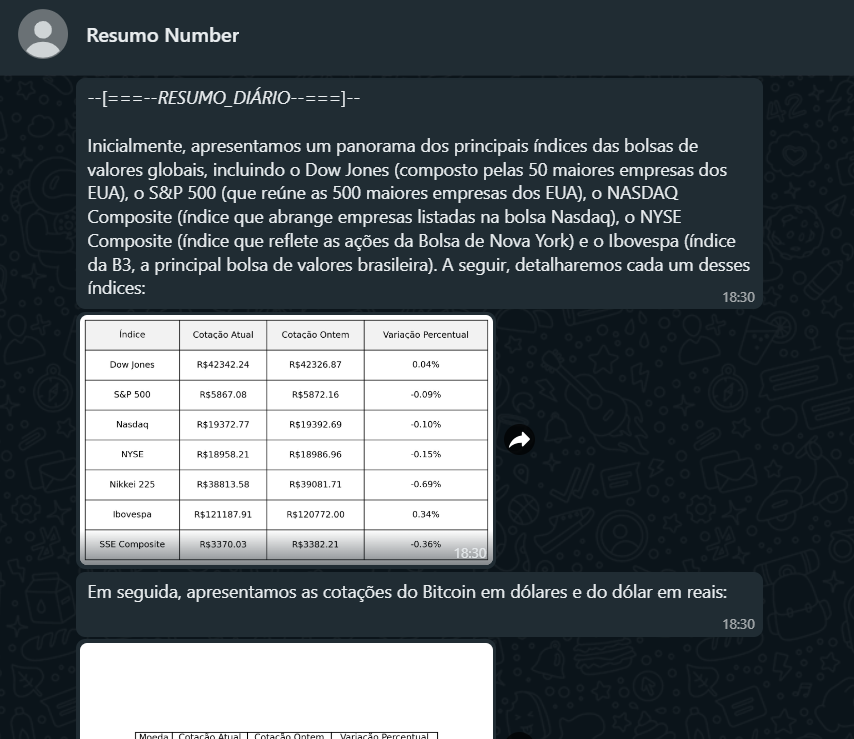
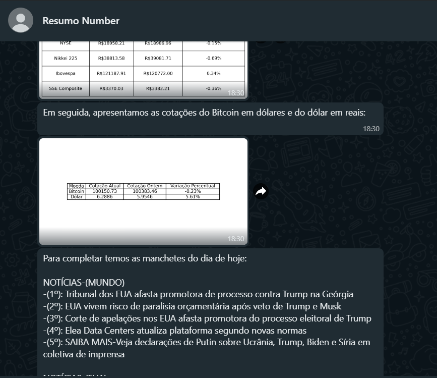

# PROJETO AUTOMAÇÃO

O projeto consiste em um programa responsável por enviar, via WhatsApp, **resumos diários** contendo:

- **Cotações** e índices financeiros.
- **Notícias relevantes** do dia.
- **Trends** do Twitter.

## Tecnologias e Bibliotecas Utilizadas

1. **Acesso a Dados Financeiros**:
   - `yfinance`: Para acessar cotações e índices monetários.

2. **Análise e Visualização de Dados**:
   - `pandas`: Para manipulação e organização dos dados.
   - `matplotlib`: Para criar tabelas e gráficos que facilitam a visualização dos valores.

3. **Web Scraping**:
   - `requests` e `BeautifulSoup`: Para coletar e selecionar notícias relevantes de sites na web.

4. **Envio via WhatsApp**:
   - **API do WhatsApp**: Utilizada para enviar as mensagens.
     - No plano gratuito, é possível usar um número de teste temporário com validade de até 60 dias.

5. **Automação do Processo**:
   - **Heroku**:
     - Funciona como repositório remoto.
     - Utilizamos o pacote **Advanced Scheduler** para agendar e executar o programa automaticamente em períodos definidos.

## Benefícios do Projeto

- **Automatização de informações financeiras e de mercado** de forma prática e acessível.
- Integração eficiente entre APIs, Web Scraping e ferramentas de automação.
- Envio direto ao WhatsApp, facilitando o acesso aos dados para o usuário final.

## Resultados:

Após realizar toda a implementação e configurar as tecnologias, o programa apresenta o seguinte resultado no WhatsApp diariamente, a partir das 18h30 🕡:

Envio dos valores de indíces relacionado as bolsas de valores ao redor do mundo.

Envio das cotações do Bitcoin e do dolar, além de algumas notícias.
